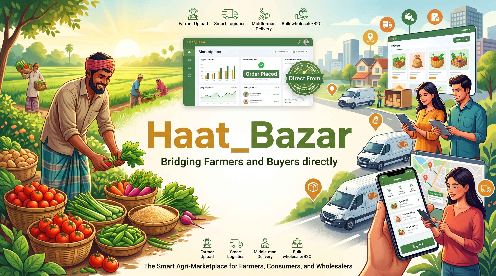

# Haat_Bazar 🌾🛒

  

  <strong>Bridging Farmers and Buyers directly. Fresh. Affordable. Fair.</strong>

  <!-- Backend -->
  
  
  
  <!-- Frontend / Mobile -->
  
  
  <!-- Devops & Infrastructure -->
  
  

---

## 1. Executive Summary & Core Mission

**Haat_Bazar (হাট বাজার)** is a multi-sided digital marketplace designed to bypass exploitative intermediaries and directly connect farmers with retail customers and bulk wholesalers. In traditional agri-supply chains, farmers lose significant margins (often over 40–50%) to multiple layers of informal brokers (*Beparis*, *Aratdars*, and *Paikars*). 

This platform serves as a modern digital middleman, charging a **transparent service and delivery fee** to cover logistics, quality assurance, and operations while ensuring:
- **Farmers** receive fairer, higher-than-market-rate prices for their hard work.
- **Buyers** (regular consumers and wholesalers) access fresh, traced, and affordable produce.
- **Economic Viability** is maintained through **dynamic minimum order thresholds (MOQs)** to prevent fragmented, low-yield deliveries that lead to high logistics costs and farmer losses.

---

## 2. Key System Elements
